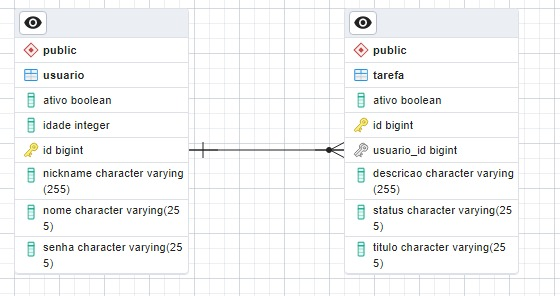

# Trabalho Engenharia de Software 🏗️🖥️

Desenvolvido para a cadeira de Engenharia de Software: Arquitetura e Padrões, no primeiro semestre de 2025.

## Visão Geral 📋:
- Este trabalho tem como propósito a implementação e documentação de uma API RESTful, 
  seguindo as melhores práticas de Arquitetura de Software. Foi desenvolvido uma API para um sistema de 
  gerenciamento de tarefas colaborativas, possibilitando que os usuários criem, editem, atribuam e finalizem 
  suas tarefas de maneira eficiente.

## Decisões Arquiteturais ☕🍃:
- A escolha da arquitetura foi a de em camadas, pois essa organização estruturada facilita a manutenção e a 
  escalabilidade do software. Cada pacote representa uma camada distinta da aplicação:
    - Config: Configurações gerais da aplicação ️.
    - Controller: Controladores que lidam com requisições HTTP.
    - Entity: Representado pelas classes Tarefa e Usuario.
    - Exception: Tratamento de exceções.
    - Mapper: Conversões e mapeamento entre objetos.
    - Repository: Interação direta com o banco de dados.
    - Service: Camada de lógica de negócio.
- Foi optada a utilização de Java com Spring Boot por conta da experiência da equipe e porque o Spring Boot utiliza arquitetura limpa.
- A escolha de utilização de um banco de dados relacional, se deu ao fato de que precisávamos de integridade e consistência de dados, além da facilidade de manutenção, padronização, escalabilidade e consultas complexas, pois caso sejam adicionados mais dados na API, o banco de dados relacional irá dar conta do grande volume de dados que precisem de consultas eficientes.

## Modelagem de Dados 🗃️📊:

## Fluxo de Requisições 👤🔑:
-  Os principais endpoints da aplicação estão dividos por recursos, onde temos:
   ## Usuario:
      - Post - criar: criar um novo usuário
      - Put  - atualizar: atualizar um usuário
      - Del  - deletar: excluir um usuário
      - Get  - detalhar: obter detalhes de um usuário específico
   ## Tarefa:
    - Post - criar: criar uma nova tarefa
    - Put  - atualizar: atualizar uma tarefa
    - Del  - deletar: excluir uma tarefa
    - Get  - detalhar: obter detalhes de uma tarefa específica
    - Get  - listar por usuário: recuperar a lista de tarefas atribuídas a um usuário específico.
   ## Autenticação:
    - Post - login: Permite que usuários façam login, enviando suas credenciais como: nome, nickname, senha e idade
    - Post - registrar: - Permite que novos usuários se cadastrem no sistema.
      - O usuário envia dados como: nome, nickname, senha e idade;
      - O sistema valida as informações e armazena o novo usuário no banco de dados.

## Configuração e Deploy ⚙️🔨: Guia de execução do projeto, incluindo dependências e configuração do ambiente:
-  Configurar essas variáveis no IntelliJ na parte de Debug: DATABASE_PASS=SUASENHADOBANCO;DATABASE_URL=jdbc:postgresql://localhost:5432/postgres;DATABASE_USER=postgres
-  Ao rodar pela primeira vez o programa, no arquivo application.properties, em 'spring.jpa.hibernate.ddl-auto=' trocar a propriedade para 'create'
-  Após rodar o programa pela primeira vez, no arquivo application.properties, em 'spring.jpa.hibernate.ddl-auto=' trocar a propriedade para 'validate' 
-  É preciso ter o Postgres instalado localmente 🐘

## Testes Automatizados 🧪✅: Estratégia utilizada e métricas de cobertura:
- Para os testes, foram utilizados:
    - Swagger: a escolha desta tecnologia foi feita porque ajuda a manter a API bem estruturada e compreensível. Permite 
    a documentação dos endpoints. 
    - JWT: o JWT em conjunto com o Swagger foi utilizado para autenticação e autorização na API, garantindo que apenas usuários autenticados possam acessar os endpoints protegidos. O usuário faz login e recebe um token JWT, que contém informações de identidade e permissões. O token expira em 24 horas. A escolha do JWT se deu pela segurança, facilidade de teste e pela padronização também. Este é o link do Swagger: http://localhost:8081/swagger-ui.html
    - Mockito: o Mockito foi utilizado pela facilidade em se implementar testes unitários sem a necessidade de utilização de implementações reais, criando assim, objetos simulados, verificando interações entre objetos e garantindo que os métodos foram chamados corretamente, simulando respostas de dependências externas como serviços ou repositórios e também pela facilidade ao implementar os testes unitários isolando partes do código para evitar efeitos colaterais.

